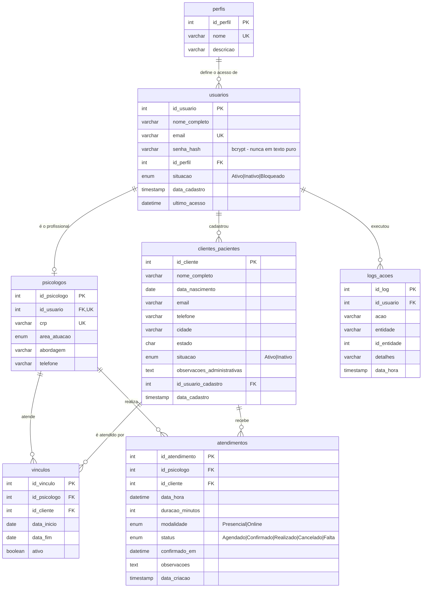

# Diagrama Entidade-Relacionamento — PsiGestor

> O diagrama abaixo está escrito em **Mermaid** e é renderizado automaticamente pelo GitHub.
> Para gerar uma imagem para o documento impresso, cole o código em <https://mermaid.live>.

## Correspondência com o modelo mínimo exigido no edital

| Entidade exigida | Tabela implementada | Observação |
|---|---|---|
| `usuarios` | `usuarios` | Credenciais, nome, e-mail, situação e vínculo com o perfil |
| `perfis` | `perfis` | Administrador, Psicologo e Atendente |
| `psicologos` | `psicologos` | Dados profissionais e área de atuação |
| `clientes_pacientes` | `clientes_pacientes` | Dados administrativos |
| `vinculos` | `vinculos` | Associação psicólogo ↔ cliente/paciente |
| `logs_acoes` | `logs_acoes` | Autor, ação, registro afetado e data/hora |
| `entidade_inovacao` | **`atendimentos`** | Agenda com confirmação (a funcionalidade inovadora) |

## Cardinalidades

| Relacionamento | Cardinalidade | Significado |
|---|---|---|
| `perfis` → `usuarios` | 1 : N | Um perfil é usado por vários usuários |
| `usuarios` → `psicologos` | 1 : 1 | Cada psicólogo é exatamente um usuário (`UNIQUE` em `id_usuario`) |
| `usuarios` → `clientes_pacientes` | 1 : N | Um usuário cadastra vários clientes (rastreabilidade) |
| `psicologos` ↔ `clientes_pacientes` | N : N via `vinculos` | Um psicólogo atende vários pacientes; um paciente pode ter mais de um psicólogo |
| `psicologos` → `atendimentos` | 1 : N | Um psicólogo realiza vários atendimentos |
| `clientes_pacientes` → `atendimentos` | 1 : N | Um paciente recebe vários atendimentos |
| `usuarios` → `logs_acoes` | 1 : N | Um usuário gera várias ações auditadas |

## Restrições de integridade

| Tipo | Onde | Finalidade |
|---|---|---|
| `UNIQUE` | `perfis.nome` | Não existem dois perfis com o mesmo nome |
| `UNIQUE` | `usuarios.email` | O e-mail identifica o usuário no login |
| `UNIQUE` | `psicologos.id_usuario` | Garante a relação 1:1 com o usuário |
| `UNIQUE` | `psicologos.crp` | Registro profissional não se repete |
| `UNIQUE` | `vinculos (id_psicologo, id_cliente)` | Impede vínculo duplicado do mesmo par |
| `UNIQUE` | `atendimentos (id_psicologo, data_hora)` | Impede dois atendimentos no mesmo horário |
| `FOREIGN KEY` | Todas as colunas `id_*` | Impede referência a registro inexistente |
| `ENUM` | `situacao`, `area_atuacao`, `modalidade`, `status` | Restringe os valores aceitos |
| `NOT NULL` | Campos obrigatórios | Garante o preenchimento mínimo |
| `INDEX` | `usuarios.situacao`, `clientes_pacientes.nome_completo`, `atendimentos.data_hora`, `logs_acoes.data_hora` | Acelera os filtros e buscas mais usados |
